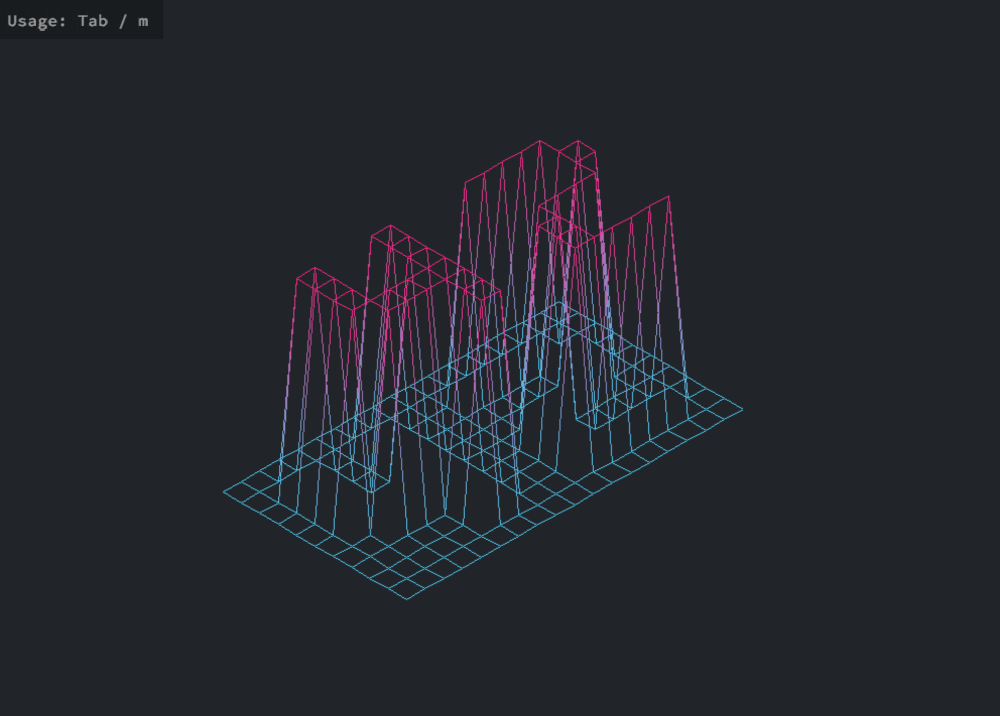
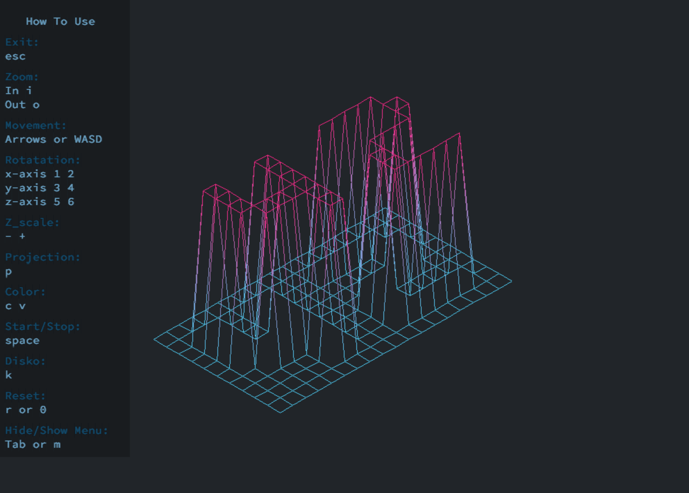
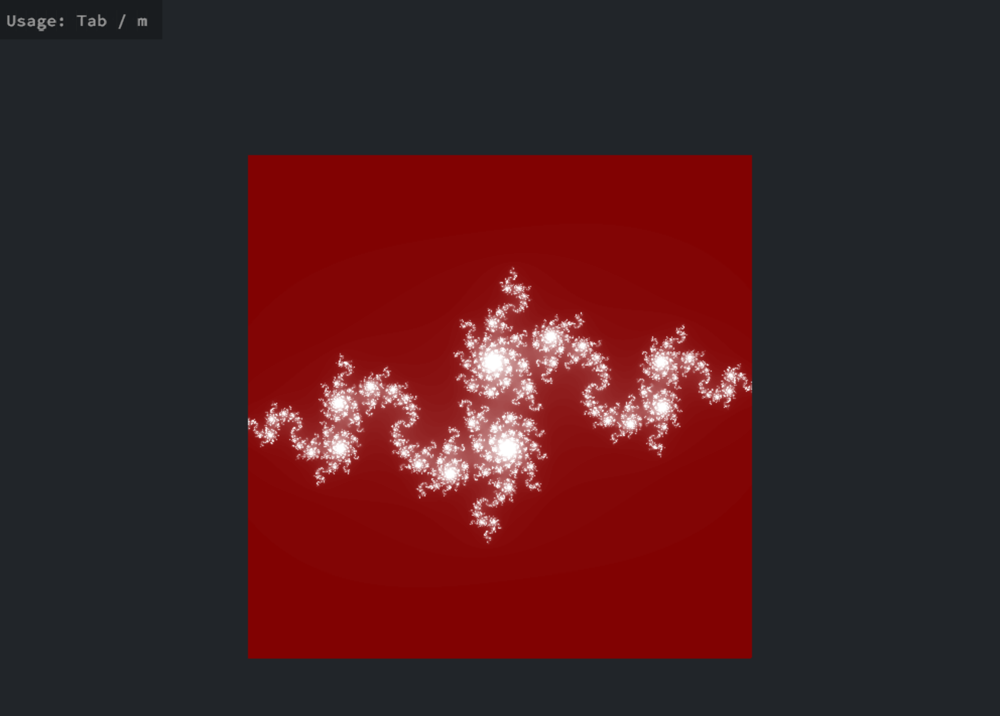

# FdF
> A graphical project to represent a landscape as a 3D object







How To Use
==========

Compile the program:<br>
```make```<br>
Run the program with a map file:<br>
```./fdf maps/42.fdf```<br>

#### Running in Docker<br>
Prerequisites:<br>
Ensure you have Docker installed on your system.<br>
If running on Linux, allow X11 forwarding with:<br>
```xhost +local:docker```<br>
Run:<br>
```make run-docker```<br>

Keys
====
Exit: esc <br>
Zoom in: i <br>
Zoom out: o <br>
Movement: Arrows or WASD <br>
Rotatation: x-axis 1 2 / y-axis 3 4 / z-axis 5 6 <br>
Z_scale: - + <br>
Change Projection: p <br>
Change Color: c v <br>
Start/Stop: space <br>
Disko: k <br>
Reset: r or 0 <br>
Hide/Show Menu: Tab, m or h <br>

Resources
==========
[Liner Algebra](https://www.youtube.com/watch?v=fNk_zzaMoSs&list=PLZHQObOWTQDPD3MizzM2xVFitgF8hE_ab) <br>
[x protocol](https://en.wikipedia.org/wiki/X_Window_System) <br>
[Xlib](https://en.wikipedia.org/wiki/Xlib) <br>
minilibix:  [Source 1](https://harm-smits.github.io/42docs/libs/minilibx) [Source 2](https://aurelienbrabant.fr/blog?q=minilibx) <br>
[dda](https://www.youtube.com/watch?v=W5P8GlaEOSI) <br>
Bresenham [Source 1](https://www.youtube.com/watch?v=RGB-wlatStc) [Source 2](https://medium.com/geekculture/bresenhams-line-drawing-algorithm-2e0e953901b3) [Source 3](http://members.chello.at/~easyfilter/bresenham.html) <br>
[Isometric Projection](https://en.wikipedia.org/wiki/Isometric_projection) <br>
[Rotation](https://en.wikipedia.org/wiki/Rotation_matrix) <br>

