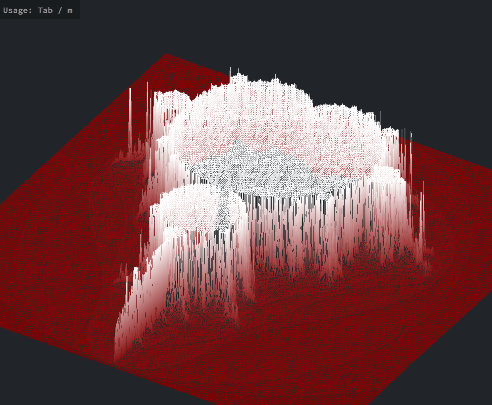

# FdF
> A graphical project to represent a landscape as a 3D object.

## Preview




## How To Use

### Compile the program:
```sh
make
```

### Run the program with a map file:
```sh
./fdf maps/42.fdf
```

### Running in Docker
#### Prerequisites:
- Ensure you have Docker installed on your system.
- If running on Linux, allow X11 forwarding with:
  ```sh
  xhost +local:docker
  ```

#### Run:
```sh
make run-docker
```

## Controls

| Action           | Key(s)        |
|-----------------|--------------|
| **Exit**        | `Esc`        |
| **Zoom in**     | `I`          |
| **Zoom out**    | `O`          |
| **Movement**    | `Arrow Keys` / `WASD` |
| **Rotation**    | `X-axis: 1, 2` / `Y-axis: 3, 4` / `Z-axis: 5, 6` |
| **Z-scale**     | `-` / `+` |
| **Change Projection** | `P` |
| **Change Color** | `C` / `V` |
| **Start/Stop Animation** | `Space` |
| **Disco Mode**  | `K` |
| **Reset**       | `R` / `0` |
| **Hide/Show Menu** | `Tab`, `M`, or `H` |

### Example Usage:
- You can click on `6` to rotate, then press `Space` to start rotation.
- Or press `K`, then `Space` to activate color-changing mode.

## Resources

- [Linear Algebra](https://www.youtube.com/watch?v=fNk_zzaMoSs&list=PLZHQObOWTQDPD3MizzM2xVFitgF8hE_ab)
- [X Protocol](https://en.wikipedia.org/wiki/X_Window_System)
- [Xlib](https://en.wikipedia.org/wiki/Xlib)
- **MiniLibX:** [Source 1](https://harm-smits.github.io/42docs/libs/minilibx) | [Source 2](https://aurelienbrabant.fr/blog?q=minilibx)
- [DDA Algorithm](https://www.youtube.com/watch?v=W5P8GlaEOSI)
- **Bresenham’s Algorithm:** [Source 1](https://www.youtube.com/watch?v=RGB-wlatStc) | [Source 2](https://medium.com/geekculture/bresenhams-line-drawing-algorithm-2e0e953901b3) | [Source 3](http://members.chello.at/~easyfilter/bresenham.html)
- [Isometric Projection](https://en.wikipedia.org/wiki/Isometric_projection)
- [Rotation](https://en.wikipedia.org/wiki/Rotation_matrix)

## 📜 License
This project is part of the **42 School curriculum** and is intended for educational purposes.

## 👥 Authors
- [GitHub Profile](https://github.com/eel-brah)
- [GitHub Profile](https://github.com/AhmedMokhtari)

